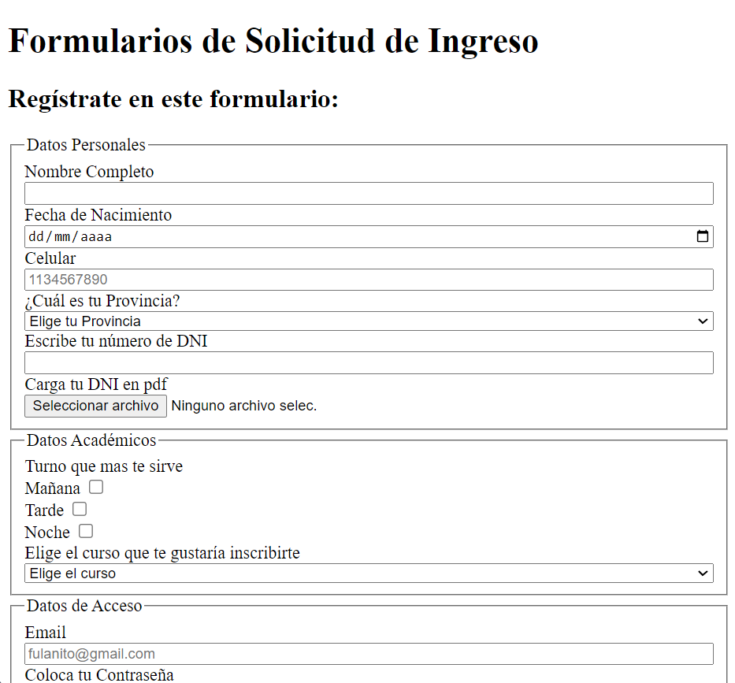

# Formulario de Solicitud de Ingreso

¡Bienvenido/a al Formulario de Solicitud de Ingreso! Este es un proyecto personal que muestra cómo crear un formulario de solicitud de ingreso utilizando HTML.

## Descripción

Este proyecto consiste en un formulario de solicitud de ingreso básico creado con HTML. El formulario incluye campos comunes que se encuentran en muchas solicitudes de ingreso, como nombre, dirección de correo electrónico, fecha de nacimiento y más.

## Capturas de Pantalla

## Cómo Usar

1. Clona este repositorio en tu máquina local: `git clone git@github.com:andyreinozaa/Formulario-SolicitudIngreso-HTML.git`
2. Abre el archivo `index.html` en tu navegador web.
3. Completa los campos del formulario con la información de ejemplo o los datos que prefieras.

## Contribuciones

Si te gustaría contribuir a este proyecto, ¡eres bienvenido/a! Puedes hacer lo siguiente:

- Mejorar el diseño y la apariencia del formulario.
- Agregar validaciones de entrada para asegurarse de que los datos sean ingresados correctamente.
- Integrar la funcionalidad de procesamiento de datos utilizando tecnologías backend como PHP, Node.js, etc.

¡Gracias por tu interés en mi proyecto de formulario de solicitud de ingreso! Si tienes alguna pregunta o sugerencia, no dudes en contactarme. ¡Disfruta explorando el código y experimentando con el formulario! 😄📝
